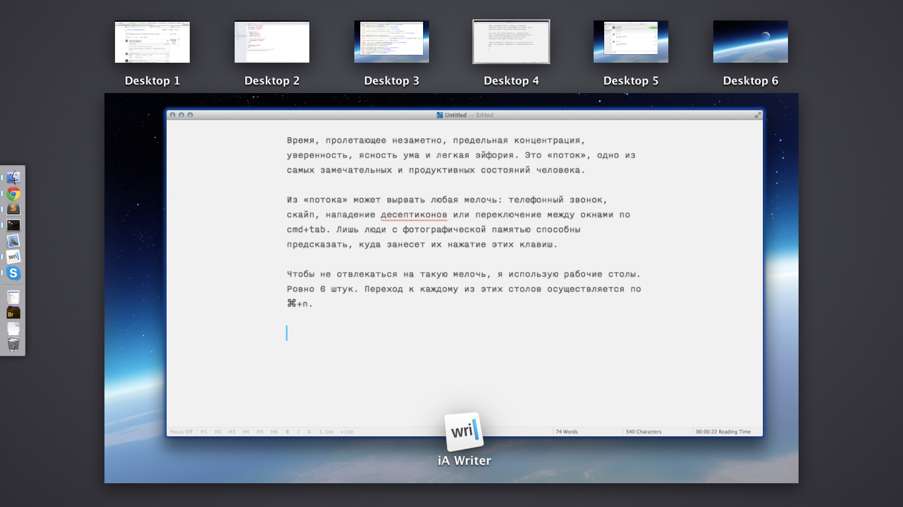

Время, пролетающее незаметно, предельная концентрация, уверенность, ясность ума и легкая эйфория. Это «поток», замечательное и продуктивное состояние человека.

Из «потока» может вырвать любая мелочь: телефонный звонок, скайп, нападение десептиконов или переключение между окнами по cmd+tab. Лишь люди с фотографической памятью способны предсказать, куда занесет их нажатие этих клавиш.

Чтобы не отвлекаться на такую мелочь, я использую рабочие столы и простые правила:

* переход на любой стол по cmd+n;
* один стол — одно приложение.

На первом столе располагается браузер, он используется чаще всего. На втором — Sublime Text, код. На третьем — Terminal, консоль. На четвертом — что-то, относящееся к текущей задаче, например, виртуалка с IE.

Последние два стола: почта и чаты. Шестой стол — исключение, его делят Flint и Hipchat.

Такой способ перемещения между приложениями быстрее и удобнее, чем ежедневное насилие над кнопкой tab.
