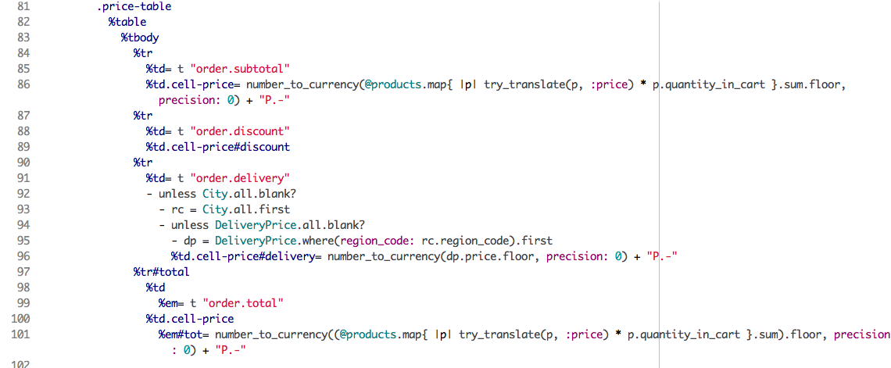
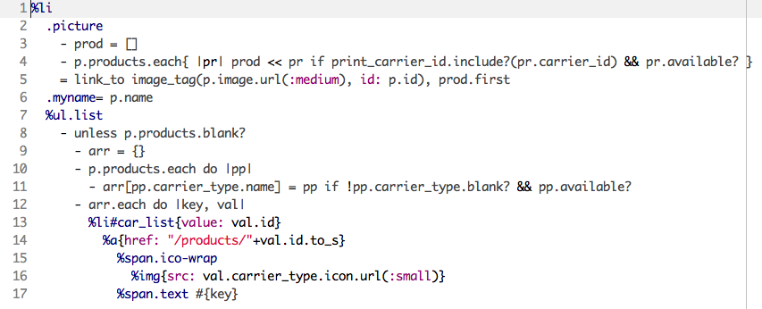
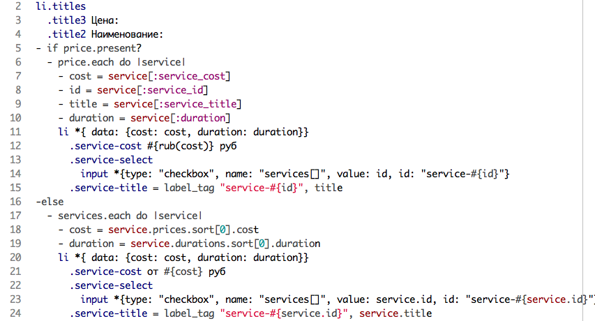

<blockquote class="pull-right">
  

    Ну, что ты братишка притих… 
    Обида залита в груди 
    Не можешь ни хавать, ни пить 
    Сука не хочется Slim
  

  <small>
    Макс Корж, «<a href="https://www.youtube.com/watch?v=sdnbZkKvVDY">Мотылек</a>»
  </small>
</blockquote>

Помимо [ленивых мудаков](/posts/not-a-designer.html) можно встретить воинствующих шаблонистов. Такие ребята могут часами доказывать, что Slim/HAML круче Erb, возвращаться на свое рабочее место и генерировать вот такой чужеродный код:

Возможно, они пишут это в состоянии аффекта. Возможно, они прилетели на Землю вместе с Жанной Агузаровой. В любом случае, это неадекватный и нечитаемый код на ультракрутом Slim/HAML.

Но ни Slim, ни HAML, ни любой другой стильный-модный-молодежный движок темплейтов не спасут от плохого кода, если у автора в голове темная субстанция из «Прометея». Писать херовый код можно на любом языке.

Не тратьте время на бессмысленные «религиозные» войны, используйте подходящий инструмент. Сохраняйте ясность ума, почаще спрашивайте себя «А не херню ли я делаю?» и пишите адекватный, логичный и красивый код.

--------------------------------

Смотрите также:

